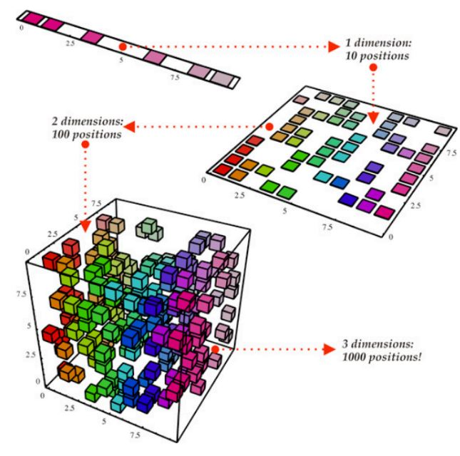
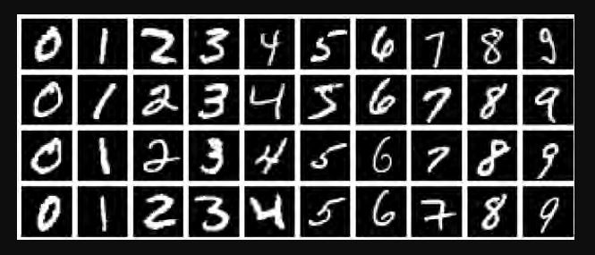
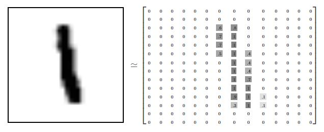
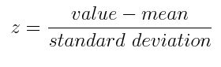
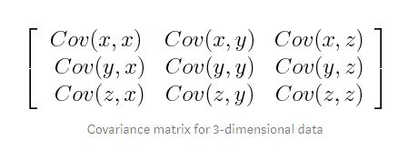
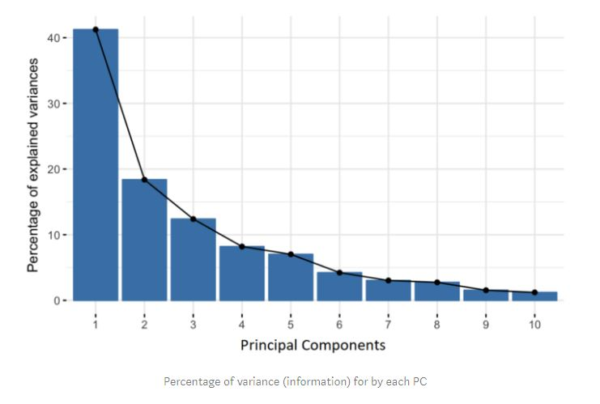
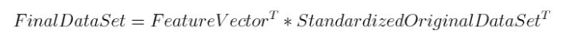
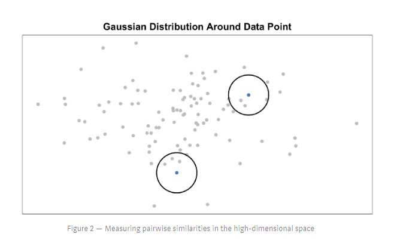
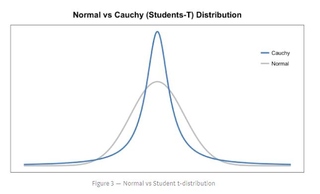
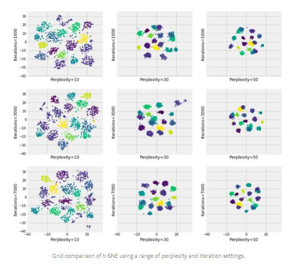

# Dimension Reduction on MNIST

Dimensionality Reduction is a powerful technique that is widely used in data analytics and data science to help visualize data, select good features, and to train models efficiently. We use dimensionality reduction to take higher-dimensional data and represent it in a lower dimension.

## Introduction -

 **We humans can visualise 2D, 3D data or images. But what if the data contains 4 dimensions? or 5 dimensions or even 100,200,500 dimensions?     
 So in such cases with the help of PCA and t-SNE we will be working with MNIST data which has 784 dimensions and are going to reduce to 2D form.**

### Packages used - 
*Multiple packages were used* in the notenook. These packages were imported into python 3 version. The packages are:
* Numpy
* Pandas
* Seaborn
* Matplotlib
* warnings
* scipy
* sklearn

### MNIST(Mixed National Institute of Standards and Technology)

MNIST is a simple computer vision dataset. It consists of 28x28 pixel images of handwritten digits, such as:

Every MNIST data point, every image, can be thought of as an array of numbers describing how dark each pixel is. For example, we might think of 1 as something like:

Since each image has 28 by 28 pixels, we get a **28x28** array. We can flatten each array into a **28∗28=784** dimensional vector. Each component of the vector is a value between zero and one describing the intensity of the pixel. Thus, we generally think of **MNIST as being a collection of 784-dimensional vectors.**

### Methods used - 

* **Principal Component Analysis ( PCA )** - Unsupervised, linear method.
* **t-distributed Stochastic Neighbour Embedding (t-SNE)** - Supervised, Nonlinear method.

#### Principal Component Analysis ( PCA ) - 
Principal Component Analysis, or PCA, is a dimensionality-reduction method that is often used to reduce the dimensionality of large data sets, by transforming a large set of variables into a smaller one that still contains most of the information in the large set.
#### *Steps involved* - 
* **Standardization** -    
The aim of this step is to standardize the range of the continuous initial variables so that each one of them contributes equally to the analysis.
Mathematically, this can be done by subtracting the mean and dividing by the standard deviation for each value of each variable so that the data can be in the range of 0 and 1

* **Covariance Matrix computation** -   
The aim of this step is to understand how the variables of the input data set are varying from the mean with respect to each other, or in other words, to see if there is any relationship between them. The covariance matrix is a p × p symmetric matrix

It’s actually the sign of the covariance that matters :
  - If positive then : the two variables increase or decrease together (correlated)
  - If negative then : One increases when the other decreases (Inversely correlated)

* **Compute the eigenvectors and eigenvalues of the covariance matrix to identify the principal components** -   
Eigenvectors and eigenvalues are the linear algebra concepts that we need to compute from the covariance matrix in order to determine the **principal components** *(new axes which has maximum number of data points)* of the data.The line that matches the purple marks because it goes through the origin and it’s the line in which the projection of the points (red dots) is the most spread out. Or mathematically speaking, it’s the line that maximizes the variance (the average of the squared distances from the projected points (red dots) to the origin).The second principal component is calculated in the same way, with the condition that it is uncorrelated with (i.e., perpendicular to) the first principal component and that it accounts for the next highest variance.
* **Feature vector** -  
The feature vector is simply a matrix that has as columns the eigenvectors of the components that we decide to keep. This makes it the first step towards dimensionality reduction, because if we choose to keep only p eigenvectors (components) out of n, the final data set will have only p dimensions.
* **Recast the data along the principal components axes** -  
In this step, which is the last one, the aim is to use the feature vector formed using the eigenvectors of the covariance matrix, to reorient the data from the original axes to the ones represented by the principal components (hence the name Principal Components Analysis). This can be done by multiplying the transpose of the original data set by the transpose of the feature vector.

#### t-distributed Stochastic Neighbour Embedding (t-SNE) - 
t-SNE, unlike PCA, is not a linear projection. It uses the local relationships/distances between points to create a low-dimensional mapping. This allows it to capture non-linear structure.
#### *Steps involved*
* **Creating a probability distribution-**   
 If data points x1 and x2 have equal values under this gaussian circle then their proportions and similarities are equal and hence you have local similarities in the structure of this high-dimensional space.The Gaussian distribution or circle can be manipulated using what’s called **perplexity**.

* **Recreating the probability distribution-**    
 Step 2 is similar to step 1, but instead of using a Gaussian distribution we use a Student t-distribution with one degree of freedom, which is also known as the Cauchy distribution.  
  The Student t-distribution has heavier tails than the normal distribution. The heavy tails allow for better modeling of far apart distances.

* **Optimization-**   
 Gradient descent is used to minimise the divergence between the two distributions by updating the values of the low dimensional data points.
 
The final result gives us data points that reflect the structure of the high dimensional data and are able to be plotted on a 2D or 3D graph.

## Conclusion-   
Despite being published over a decade ago, t-SNE remains one of the most popular methods of dimensionality reduction for visualization, and for good reason. It is robust, flexible, and overall produces good results.

